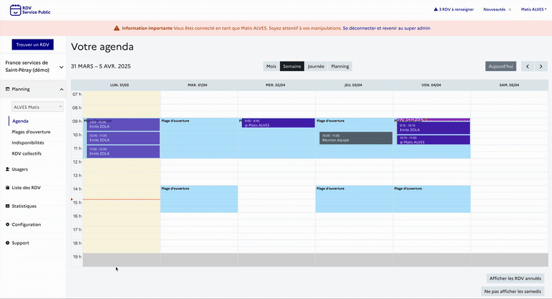

# (Matis) Configurer son organisation

Vous êtes **Agent Admin** et disposez alors d'un accès au menu _Configuration_ permettant de paramétrer votre compte RDV Service Public. Ce premier niveau de configuration permettra à tous les **Agent Basique** de votre structure d'utiliser leur agenda et de planifier des rendez-vous. &#x20;

<strong>Inviter vos agents</strong> 

Pour inviter des agents à rejoindre votre organisation sur **RDV Service Public**, rendez-vous dans le menu _**Configuration**_, puis cliquez sur l’onglet _**Agents**_.

**Choix du niveau de permission**

Lors de l’invitation d’un agent, vous devez définir son niveau de permission. Trois niveaux sont disponibles :

*   **Basique** :\
    Ce niveau permet à l’agent de :

    * Gérer ses propres plages d’ouverture, indisponibilités et rendez-vous ;
    * Gérer les rendez-vous des agents appartenant au **même service**.

    L’agent **basique n’a pas accès à l’onglet "Configuration"**, et ne peut donc pas modifier les paramètres de l’organisation.

* **Administrateur** :\
  Ce niveau donne à l’agent des droits étendus :
  * Accès à l’agenda **de tous les agents** de l’organisation, quel que soit leur service ;
  * Possibilité de modifier les plages d’ouverture, les indisponibilités et les rendez-vous de tous les agents ;
  *   Accès au menu _**Configuration**_, lui permettant de :

      * Inviter d'autres agents.
      * Créer et modifier des motifs de rendez-vous ;
      * Ajouter des lieux de permanences;
      * Modifier les informations de l'organisation (nom, contact, etc.)

*   **Intervenant** :\
    Le statut **intervenant** fonctionne différemment des deux précédents :

    * Il **n’est pas lié à une adresse e-mail** ;
    * Sa création génère un **agenda autonome**, que vous pouvez nommer librement ;
    * Cet agenda est ensuite **géré par les autres agents** de l’organisation.

    Ce statut est idéal pour des **partenaires externes** effectuant des permanences ponctuelles dans votre structure. Bien qu’ils ne possèdent pas de compte **RDV Service Public**, les rendez-vous peuvent tout de même être pris sur cet agenda intervenant.

**Association à un ou plusieurs services**

Après avoir défini le niveau de droit et renseigné l’adresse e-mail de l’agent (sauf pour un intervenant), vous devez l’associer au(x) service(s) auquel(s) il est rattaché.

✅ Il est possible de rattacher un agent à **plusieurs services**.\
⚠️ Attention : **une fois cette étape validée, il ne sera plus possible de modifier les services associés à l’agent**.

Si un changement est nécessaire :

* Contactez l’**Administrateur de Territoire** de votre compte **RDV Service Public** ;
* Supprimez l’agent concerné, puis recommencez l’invitation avec les bons paramètres.

***

<strong>Créer vos motifs</strong>

Vous pouvez créer ou modifier des motifs depuis le menu _**configuration**_ puis _**motifs**_.&#x20;

Le motif est la raison du rendez-vous. Il permet de catégoriser les prises de rendez-vous, d’informer l’agent sur le contenu attendu et d’affiner les options (présentiel, téléphone, visio, option de prise de rendez-vous en ligne).&#x20;

Vous trouverez des options de configurations organisées sous 3 onglet :&#x20;

&#x20;                                           

***

**Information générale**&#x20;

Un motif est avant tout un objet de rendez-vous qui se configure par un nom, une durée par défaut, un type et un service associé.&#x20;

Une fois configurés, tous vos motifs seront alors accessibles aux agents des services associés. Les agents pourront créer des plages de disponibilités avec des motifs configurés et ainsi faciliter la recherche de créneaux dans votre organisation. Ils pourront également planifier des rendez-vous.&#x20;

Si vous souhaitez proposer plusieurs modalités de rendez-vous (sur place, par téléphone, par visioconférence ou à domicile) ou plusieurs durée par défaut (30 minutes ou 60 minutes) pour un même motif, il sera nécessaire de dupliquer et créer plusieurs motifs.&#x20;

***

**Réservation en ligne**&#x20;

Un motif peut-être ouvert ou non à la prise de rendez-vous en ligne. Vous pouvez sélectionner cette option depuis l'onglet _**réservation en ligne**_ de l'écran de configuration des motifs.&#x20;

Vous devez cocher la case _ouvert aux usagers_. Elle viendra activer une pastille _en ligne_ pour chaque motif.&#x20;

Dès lors que vous ouvrez la prise de rendez-vous en ligne pour un motif, vous accéderez à des options de configurations supplémentaires liées au **délais minimum et maximum de réservation**. En configurant ces options, vous pouvez limiter la visibilités des disponibilités des plages de disponibilités des agents dans le parcours de prise de rendez-vous en ligne.

Aussi, vous pouvez offrir la possibilité à vos usagers de **modifier leur créneau de rendez-vous en autonomie**. Un bouton déplacer le RDV s'affichera depuis leur récapitulatif de rendez-vous accessible depuis les notifications email et SMS :&#x20;

***

**Instruction et notification**

Vous pouvez personnaliser des instructions de rendez-vous motif par motif. Vous pouvez personnaliser ces instructions depuis l'onglet _**notification et instruction.**_&#x20;

Ces informations apparaîtront ainsi dans les récapitulatif de rendez-vous accessible depuis les notifications **email** ou **SMS.**&#x20;

<strong>Créer vos lieux</strong> 

<strong>Configurer vos informations de contacts</strong>

Vous pouvez personnaliser les informations de contacts de votre administration depuis le menu _**configuration**_ puis _**informations de contacts.**_&#x20;

Cette fonctionnalité répond à un besoin usager. Celui de pouvoir facilement contacter son administration en cas de besoin (difficultés à annuler son rendez-vous en autonomie, besoin d'informations complémentaires au rendez-vous, demande de modification de rendez-vous etc ...).&#x20;

Ces informations apparaîtront ainsi dans les récapitulatif de rendez-vous accessible depuis les notifications **email** ou **SMS** :&#x20;

&#x20;                                              .gif>)

<strong>Activer la prise de rendez-vous en ligne</strong> 

* Commune avec <mark style="color:purple;">**France Titres**</mark>

* Conseillers Numériques avec la <mark style="color:purple;">**Cartographie Nationale des lieux d'inclusion numérique**</mark>

