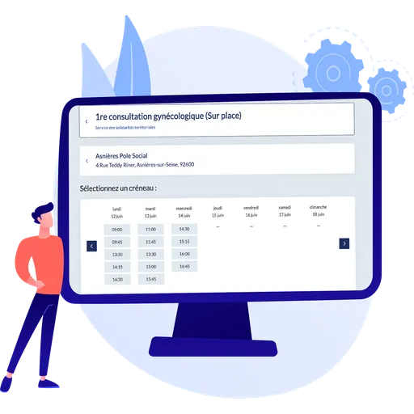
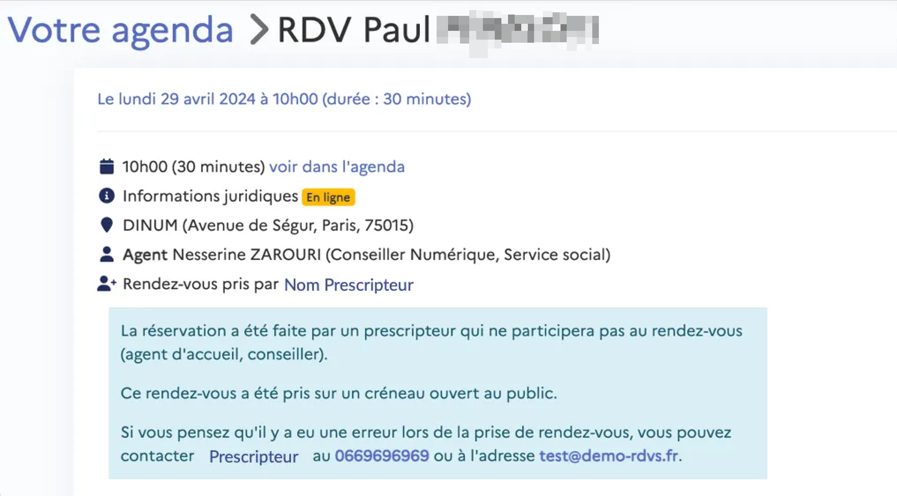

# Prescription

### Qu’est-ce qu’est la prescription ?

<figure><figcaption></figcaption></figure>

RDV Solidarités a pour objectif de faciliter la mise en relation entre les usagers et les agents, ainsi qu'entre les agents de différentes structures et entités administratives. C’est dans ce contexte que la fonctionnalité de prescription a été pensée.

La prescription permet à un agent externe à l'organisation de planifier rendez-vous au nom de l’usager, en fonction des disponibilités de l'agent RDV Solidarités

À titre d'exemple, la prescription offre la possibilité à un agent de médiathèque (le prescripteur) à prendre rendez-vous pour un apprenant avec un conseiller numérique (l’agent RDV Solidarités).

Dans cette logique de mise en relation, la prescription peut prendre deux formes : la prescription interne et la prescription externe.

Globalement, la **prescription interne** concerne les agents utilisateurs de RDV Solidarités (ayant un compte) qui souhaitent orienter un usager vers une structure à laquelle l'agent planifiant le rendez-vous n'appartient pas.

Quant à la **prescription externe**, elle s'adresse aux agents qui n'ont pas de compte RDV Solidarités mais qui sont amenés à planifier des rendez-vous de manière régulière pour les usagers en fonction des disponibilités des agents utilisateurs de RDV Solidarités.

### En tant qu’administrateur, comment rendre les créneaux de réservation en ligne disponibles pour les prescripteurs ?

<figure><figcaption></figcaption></figure>

Tout comme l’ouverture en ligne aux usagers, proposer des créneaux de prise de rendez-vous aux prescripteurs nécessites deux conditions :

* motif ouvert en ligne : Veuillez suivre le chemin suivant : Paramètres → Motifs → Éditer ou créer un motif → Onglet "Réservation en ligne" → Cochez la deuxième proposition dans l'encadré "Réservation en ligne".
* plage d’ouverture : Définissez la plage d'ouverture durant laquelle le prescripteur peut planifier un rendez-vous pour l'usager. Pour ce faire, suivez le chemin suivant : Plages d'ouverture → Éditer ou créer une plage d'ouverture → Sélectionnez un motif avec la pastille "En ligne".

### En tant que prescripteur, comment planifier un rendez-vous pour un usager ?

#### Je suis un agent ayant un compte RDVS et je souhaite planifier un rendez-vous sein d’une organisation de mon territoire (prescription interne)

**Je souhaite faire de la prescription interne pour un usager identifié 👇**

{% embed url="https://files.gitbook.com/v0/b/gitbook-x-prod.appspot.com/o/spaces%2FCZACpx16wwY8yODH1YeI%2Fuploads%2FnFOLvM6JphSLygk0uMId%2Ftest.mp4?alt=media&token=505c02b5-61c4-4396-ac6f-5af8ef9e47a3" %}

Dans le cadre d’un accompagnement, l’usager doit suivre un parcours de rendez-vous le renvoyant d’une organisation à une autre. Dans ce contexte, le point de départ est l’identification de l’usager. Vous pouvez donc réorienter l’usager auprès d’une autre organisation du territoire en suivant ce chemin :

Identifier un usager → Trouver un RDV → Cliquer sur “élargir votre recherche” → Sélectionner les informations du rendez-vous (motif, lieux, créneaux) → valider le RDV en cliquant sur “Confirmer le RDV”


Nous vous encourageons à privilégier ce chemin lorsqu'un motif est soumis à une sectorisation


**Je souhaite faire de la prescription interne pour un usager non-identifié 👇**

{% embed url="https://files.gitbook.com/v0/b/gitbook-x-prod.appspot.com/o/spaces%2FCZACpx16wwY8yODH1YeI%2Fuploads%2FR7lSbQLXElbCWk74E9pY%2F2.mp4?alt=media&token=8128ac9a-e443-4259-be4f-1156dcd79b4f" %}

Dans le cas où le motif de consultation nécessite une obtention rapide du rendez-vous, il est possible de trouver un créneau disponible plus rapidement dans une organisation voisine. Pour proposer un créneau plus rapidement dans une organisation voisine, l’agent prescripteur interne peut emprunter le chemin suivant :

Dirigez-vous vers le bouton “Trouver un RDV” → cliquez sur “élargir votre recherche” → Sélectionnez les informations du rendez-vous (motif, lieu, créneaux et usagers) → validez le RDV en cliquant sur “Confirmer le RDV”.


Nous vous encourageons à privilégier ce chemin pour offrir des disponibilités plus rapidement


**Je souhaite planifier un rendez-vous pour un usager depuis un lien prescripteur 👇**&#x20;


Nouveauté ✨


{% embed url="https://files.gitbook.com/v0/b/gitbook-x-prod.appspot.com/o/spaces%2FCZACpx16wwY8yODH1YeI%2Fuploads%2FMsnRJ4XM3Qns27yjixs6%2F3.mp4?alt=media&token=6daf58c1-df06-4e8f-832e-2cb3de8bd2cd" %}

À partir du lien prescripteur ([https://www.rdv-solidarites.fr/prendre\_rdv?prescripteur=1](https://www.rdv-solidarites.fr/prendre_rdv?prescripteur=1)), vous avez également la possibilité de planifier un rendez-vous par prescription. Pour ce faire, il vous suffit d'entrer l'adresse postale de l'usager. Une fois cette adresse indiquée, sélectionnez le service, le motif, le lien et le créneau de rendez-vous. Après avoir saisi toutes ces informations, un bandeau vert vous propose de finaliser la prise de rendez-vous en cliquant sur "cliquez ici ».Cette proposition n'apparaît que lorsque vous êtes connecté à votre compte agent et vous permet de vous identifier directement.

Vous serez alors redirigé vers une page qui conserve les informations préalablement sélectionnées, et vous pourrez clôturer la prise de rendez-vous en identifiant l'usager. Confirmez le rendez-vous.


Nous vous encourageons à privilégier ce chemin lorsque vous êtes déjà connecté sur RDV. En etant authentifié sur votre espace, vous n’aurez plus besoin d’indiquer vos coordonnées


#### Je suis un agent sans compte RDVS et je souhaite planifier un rendez-vous auprès une organisation utilisatrice de RDVS

**Je souhaite planifier un rendez-vous auprès d’une organisation utilisatrice de RDVS 👇**

En tant qu’agent d’une organisation utilisatrice de RDVS, vous pouvez planifier des rendez-vous selon les disponibilités des agents RDVS pour les usagers.

{% embed url="https://files.gitbook.com/v0/b/gitbook-x-prod.appspot.com/o/spaces%2FCZACpx16wwY8yODH1YeI%2Fuploads%2F6LqpkBISSeVJQjpAqaQk%2F4.mp4?alt=media&token=44a641dc-c71a-45e4-99ef-ef0b81eb9de3" %}

Il existe deux entrés pour accéder au parcours prise de rendez-vous :

* le lien propre à l’organisation que l’agent peut vous communiquer
* lien prescripteur : [https://www.rdv-solidarites.fr/prendre\_rdv?prescripteur=1](https://www.rdv-solidarites.fr/prendre_rdv?prescripteur=1)

Une fois que vous avez reçu le lien, sélectionnez les éléments du rendez-vous dans cet ordre : le service, le motif, le lien, puis le créneau.

Lors de l'identification, cliquez sur "**Je suis un prescripteur orientant un bénéficiaire**" via ce lien. Ensuite, veuillez renseigner vos coordonnées. Le nom, le prénom et l'adresse e-mail professionnel sont des champs obligatoires. Quant au numéro de téléphone, il est fortement recommandé. Ces informations seront visibles par l'agent chargé de la gestion du rendez-vous, lui permettant ainsi de revenir vers le prescripteur en cas de questions sur le contexte du rendez-vous, par exemple.

Ensuite, il est nécessaire de renseigner les coordonnées de l'usager et confirmer le rendez-vous. Une fois confirmé, vous recevrez une notification par e-mail pour confirmer cette mise en relation

### F.A.Q

#### Qui reçoit les notifications pour les prise de rendez-vous par prescription ?

La prescription implique trois acteurs : le prescripteur, l’usager et l’agent. Tous ces acteurs sont informés du rendez-vous par notifications.

* Le prescripteur reçoit une notification par e-mail confirmant le rendez-vous pour le patient.
* Le patient reçoit une confirmation de rendez-vous ainsi qu'un rappel 48 heures avant le rendez-vous avec le professionnel.
* Le professionnel voit le rendez-vous apparaître directement dans son agenda. Selon la configuration de synchronisation, il peut également recevoir un e-mail ou voir le rendez-vous être importé automatiquement dans son agenda externe.

#### Est-il possible pour un prescripteur d’annuler ou de modifier un RDV ?

Une fois le rendez-vous planifié, le prescripteur n’intervient plus dans la gestion de celui-ci. L'annulation ou la modification d'un rendez-vous peut être initiée par les parties concernées, à savoir l’agent et l’usager.

#### Est-il possible de contacter un prescripteur ?

Dans le cas où l'agent a besoin de plus d'informations sur le contexte de la prise de rendez-vous, il peut contacter le prescripteur en utilisant les informations laissées par ce dernier (au minimum, son adresse e-mail professionnelle, et idéalement, son numéro de téléphone). L'agent peut retrouver les coordonnées du prescripteur en suivant ce chemin :

Sélectionner le rendez-vous (soit en double-cliquant sur l’agenda, soit depuis la liste des RDV) → Dirigez vous vers “Rendez-vous pris par” et cliquez sur le nom du prescripteur. Vous retrouver l’identité ainsi que les informations pour contacter le prescripteur

voir le détail de rendez-vous 👇

<figure><figcaption></figcaption></figure>

